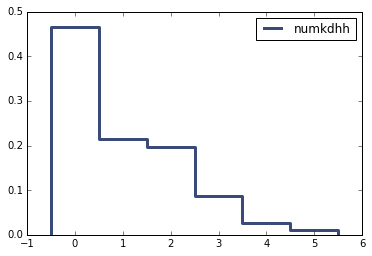
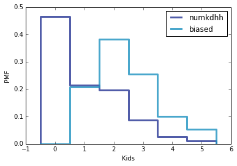

[Think Stats Chapter 3 Exercise 1](http://greenteapress.com/thinkstats2/html/thinkstats2004.html#toc31) (actual vs. biased)

Exercise from Think Stats, 2nd Edition (thinkstats2.com)<br>
Allen Downey

Read the female respondent file.

```python
%matplotlib inline

import chap01soln
resp = chap01soln.ReadFemResp()
```


Make a PMF of <tt>numkdhh</tt>, the number of children under 18 in the respondent's household.

```python
import thinkstats2
kids = thinkstats2.Pmf(resp.numkdhh, label="numkdhh")
```


Display the PMF.

```python
import thinkplot
thinkplot.pmf(kids)
thinkplot.Show()
```



Define <tt>BiasPmf</tt>.

```python
def BiasPmf(pmf, label=''):
    """Returns the Pmf with oversampling proportional to value.

    If pmf is the distribution of true values, the result is the
    distribution that would be seen if values are oversampled in
    proportion to their values; for example, if you ask students
    how big their classes are, large classes are oversampled in
    proportion to their size.

    Args:
      pmf: Pmf object.
      label: string label for the new Pmf.

     Returns:
       Pmf object
    """
    new_pmf = pmf.Copy(label=label)

    for x, p in pmf.Items():
        new_pmf.Mult(x, x)
        
    new_pmf.Normalize()
    return new_pmf
```


Make a the biased Pmf of children in the household, as observed if you surveyed the children instead of the respondents.

```python
biased_kids = BiasPmf(kids, label="biased")
```

Display the actual Pmf and the biased Pmf on the same axes.

```python
thinkplot.PrePlot(2)
thinkplot.Pmfs([kids, biased_kids])
thinkplot.Show(xlabel='Kids', ylabel='PMF')
```



Compute the means of the two Pmfs.

```python
kids_mean = kids.Mean()
biased_mean = biased_kids.Mean()

print("Unbias Mean: {}".format(kids_mean))
print("Bias Mean: {}".format(biased_mean))
```
  Unbias Mean: 1.024205155043831
  
  Bias Mean: 2.403679100664282
