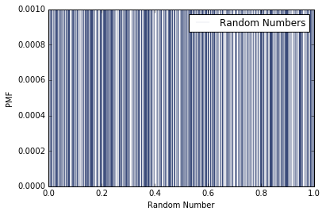
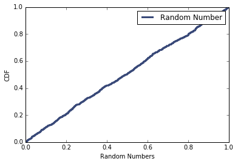

[Think Stats Chapter 4 Exercise 2](http://greenteapress.com/thinkstats2/html/thinkstats2005.html#toc41) (a random distribution)

Exercise from Think Stats, 2nd Edition (thinkstats2.com)<br>
Allen Downey

Read the pregnancy file.

```python
import nsfg
preg = nsfg.ReadFemPreg()
```

Generate 1000 random values using <tt>random.random()</tt> and plot their PMF.

```python
%matplotlib inline
import random
nums = [ random.random() for x in range(1000) ]
# while len(nums) < 1000:
#     nums.append(random.random())

import thinkplot
import thinkstats2
nums_pmf = thinkstats2.Pmf(nums, label="Random Numbers")
thinkplot.Pmf(nums_pmf, linewidth=.1)
thinkplot.Show(xlabel='Random Number', ylabel='PMF')
```




Assuming that the PMF doesn't work very well, try plotting the CDF instead.

```python
nums_cdf = thinkstats2.Cdf(nums)
thinkplot.Cdf(nums_cdf, label='Random Number')
thinkplot.Show(xlabel='Random Numbers', ylabel='CDF')
```


